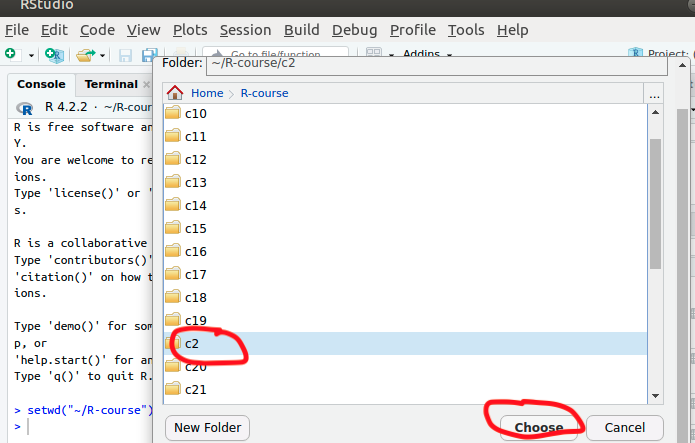
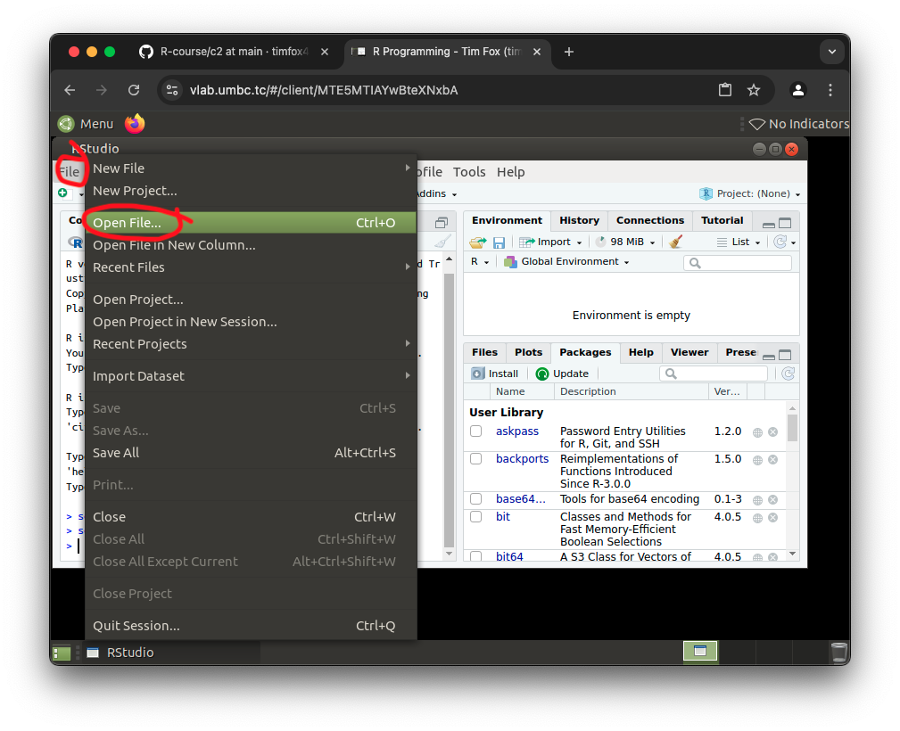
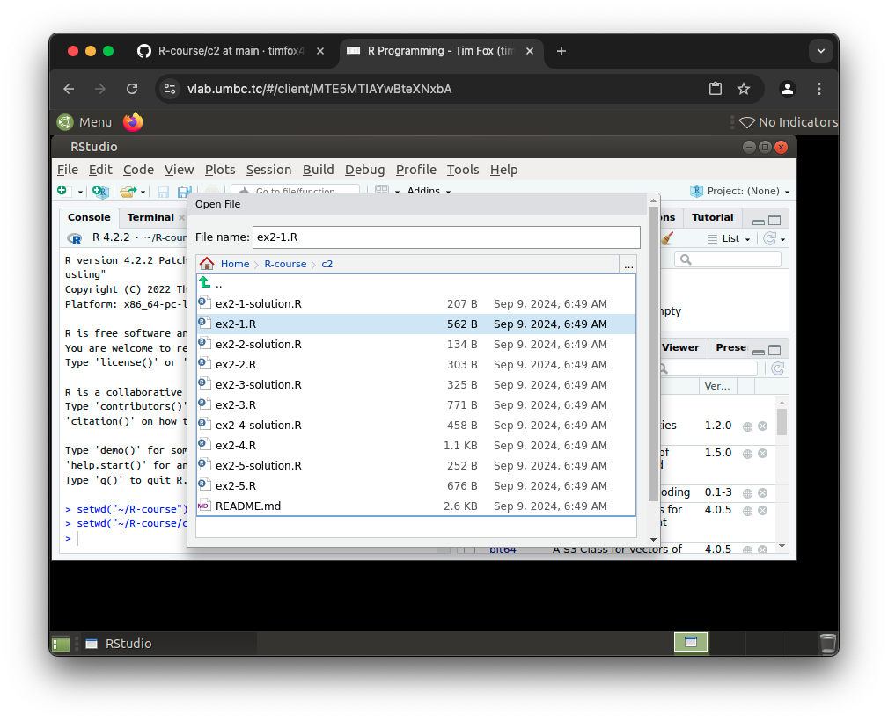
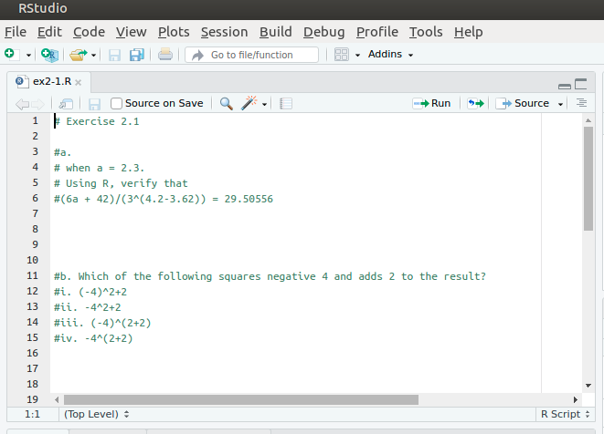
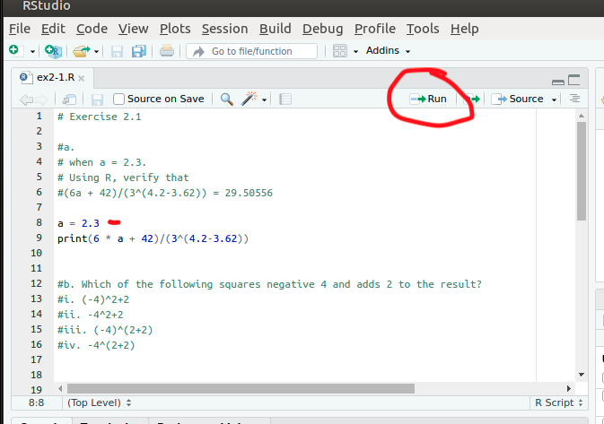
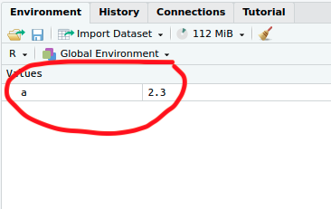
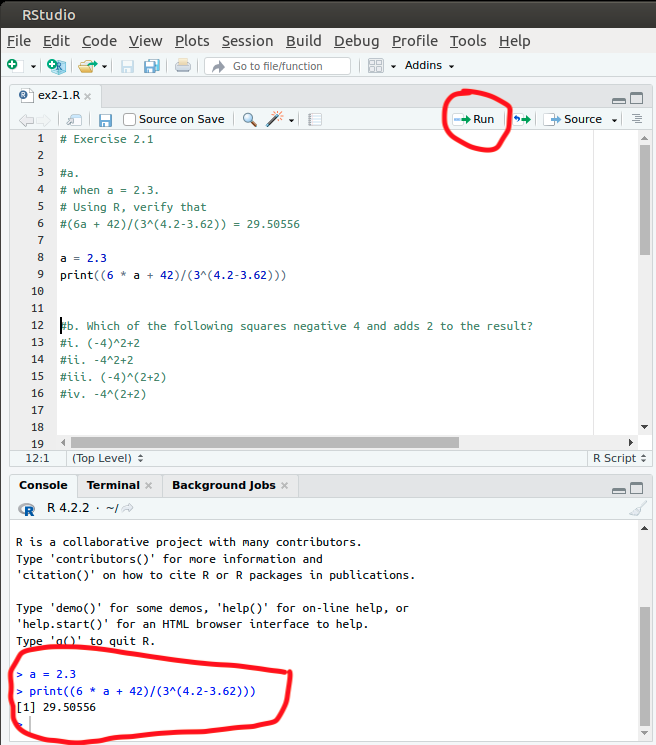

# Chapter 2


## Getting Started 


### Step 1: Set working Directory to directory `c2`



### Step 2: Go to the open file dialog




### Step 3: Select the file `ex2-1.R`




### Step 4: Observe the loaded file in Rstudio




### Step 5: Compose the following lines of code according to the instructions

First compose the code as shown: (on lines 8,9)

```R
a = 2.3
print((6 * a + 42)/(3^(4.2-3.62)))

```


### Step 6: Press the "Run" button to run a single line of code

Ensure the cursor is on line 8" `a = 2.3`

Press the run button once:


You should see the console below echo the value

```console
> a = 2.3
```

You should see the following show up in the "Environment" tab in the upper left:




### Step 7: Run the second line of code (line 9)

Ensrue the cursor is on line 9

Again press the "run" button as you did in the previous step.


Here is what it looks like when you have run those lines:




Note that you see the response in the console below.  Here is what it looks like:


```console
> print((6 * a + 42)/(3^(4.2-3.62)))
[1] 29.50556
```

Ignore the `[1]` for now, we will explain that later.


### Step 8: Complete the Exercises, referring to the solution if need be.

Go ahead and complete the exercises fond on [Exercise 2-1](ex2-1.R) in the 
RStudio editor.  You are encouraged to refer to the [Exercise 2-1 Solution](ex2-1-solution.R).

You will notice that the solution for Exercise 2-1 is as follows:

```R
#########
## 2.1 ##
#########
#(a)
(6*2.3+42)/(3^(4.2-3.62))
#(b)
(-4)^2+2
#(c)
sqrt(x=0.5*((25.2+15+16.44+15.3+18.6)/5))
#(d)
log(x=0.3)
#(e)
exp(x=-1.203973)
#(f)
-0.00000000423546322
```

Each one of these is the "answer" for the questions in the exercise.


##  Chapter 2 Source Code (refernece)

### Section 2.1 

###  2.1.1

```R
2+3
14/6
14/6+5
14/(6+5)
3^2
2^3

#

sqrt(x=9)
sqrt(x=5.311)

#

10^2+3*60/8-3
5^3*(6-2)/(61-3+4)
2^(2+1)-4+64^((-2)^(2.25-1/4))
(0.44*(1-0.44)/34)^0.5
```


### 2.1.2 ##

```R
log(x=243,base=3)

#

exp(x=3)

#

log(x=20.08554)


## 2.1.3 ##

2342151012900
0.0000002533

```


### Section 2.2 

```R
x <- -5
x
x = x + 1
x

mynumber = 45.2

y <- mynumber*x
y

ls()

```


## Section 2.3 

### 2.3.1

```R
myvec <- c(1,3,1,42)
myvec

#

foo <- 32.1
myvec2 <- c(3,-3,2,3.45,1e+03,64^0.5,2+(3-1.1)/9.44,foo)
myvec2

#

myvec3 <- c(myvec,myvec2)
myvec3

```


## 2.3.2 ##

```R
3:27

#

foo <- 5.3
bar <- foo:(-47+1.5)
bar

#

seq(from=3,to=27,by=3)

#

seq(from=3,to=27,length.out=40)

#

foo <- 5.3
myseq <- seq(from=foo,to=(-47+1.5),by=-2.4)
myseq

#

myseq2 <- seq(from=foo,to=(-47+1.5),length.out=5)
myseq2

#

rep(x=1,times=4)
rep(x=c(3,62,8.3),times=3)
rep(x=c(3,62,8.3),each=2)
rep(x=c(3,62,8.3),times=3,each=2)

#

foo <- 4
c(3,8.3,rep(x=32,times=foo),seq(from=-2,to=1,length.out=foo+1))

#

sort(x=c(2.5,-1,-10,3.44),decreasing=FALSE)

sort(x=c(2.5,-1,-10,3.44),decreasing=TRUE)

foo <- seq(from=4.3,to=5.5,length.out=8)
foo
bar <- sort(x=foo,decreasing=TRUE)
bar

sort(x=c(foo,bar),decreasing=FALSE)

#

length(x=c(3,2,8,1))

length(x=5:13)

foo <- 4
bar <- c(3,8.3,rep(x=32,times=foo),seq(from=-2,to=1,length.out=foo+1))
length(x=bar)

```


### 2.3.3 

```R

myvec <- c(5,-2.3,4,4,4,6,8,10,40221,-8)
length(x=myvec)
myvec[1]

foo <- myvec[2]
foo

myvec[length(x=myvec)]

#

myvec.len <- length(x=myvec)
bar <- myvec[myvec.len-1]
bar

#

1:myvec.len

#

myvec[-1]

#

baz <- myvec[-2]
baz

#

qux <- myvec[-(myvec.len-1)]
qux

#

c(qux[-length(x=qux)],bar,qux[length(x=qux)])

#

length(x=qux)
qux[-length(x=qux)]

#

bar <- myvec[myvec.len-1]
bar

#

qux[length(x=qux)]

#

myvec[c(1,3,5)]

#

1:4
foo <- myvec[1:4]
foo

#

length(x=foo):2
foo[length(foo):2]

indexes <- c(4,rep(x=2,times=3),1,1,2,3:1)
indexes
foo[indexes]

#

foo[-c(1,3)]

#

bar <- c(3,2,4,4,1,2,4,1,0,0,5)
bar
bar[1] <- 6
bar

#

bar[c(2,4,6)] <- c(-2,-0.5,-1)
bar

#

bar[7:10] <- 100
bar


## 2.3.4 ##

foo <- 5.5:0.5
foo
foo-c(2,4,6,8,10,12)

#

bar <- c(1,-1)
foo*bar

#

baz <- c(1,-1,0.5,-0.5)
foo*baz

#

qux <- 3
foo+qux

#

foo

#

sum(foo)

#

prod(foo)

#

foo
foo[c(1,3,5,6)] <- c(-99,99)
foo

```

