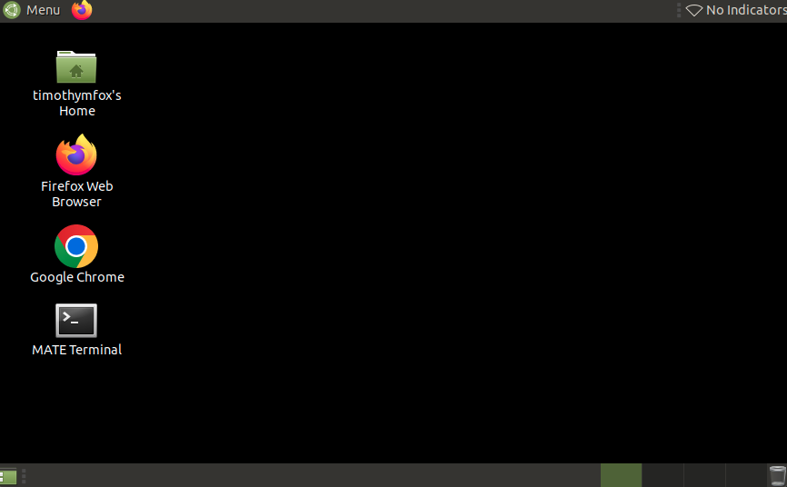
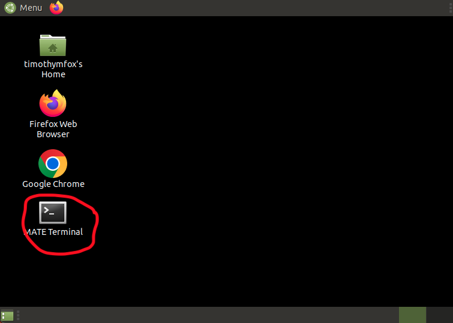
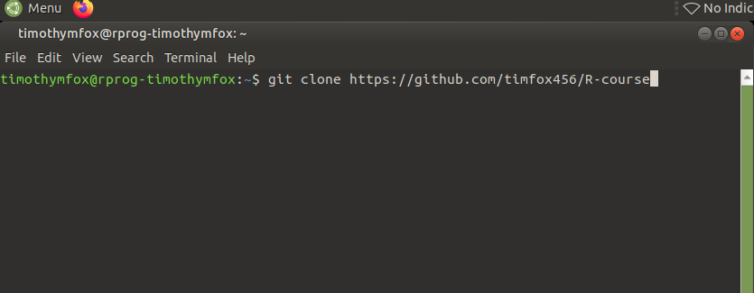
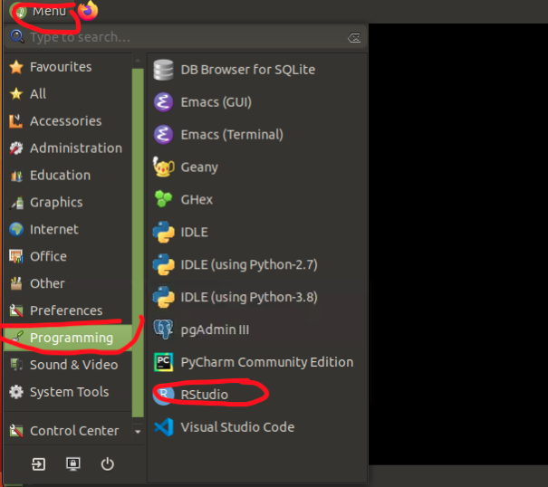
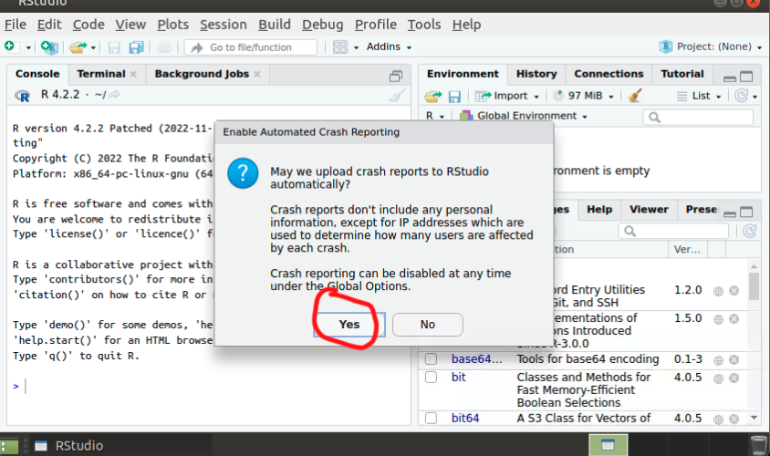
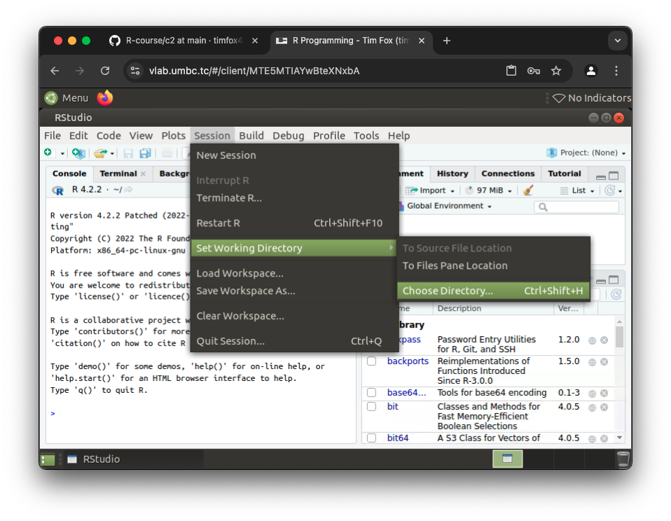
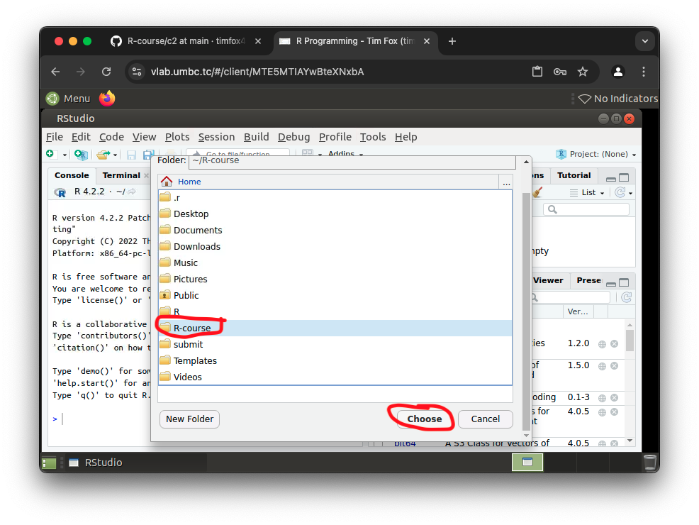

# R Course

# Lab 0: Getting Started

Welcome to the R language course. In this course we will be going through the book "The Book of R".


## Step 1: Log into the Lab Environment


You should have been given a lab VM that you can log into. If you are doing this course at UMBC, then
the lab should be at https://vlab.umbc.tc  . Please follow the directions to do the login.  Once you 
have done so, you should see the following desktop.




If you are not doing the lab here, then please get to the machine at which you are going to do the lab.
You may need to install R runtime and Rstudio, if you have not done so.


## Step 2: Clone these labs in your lab machine.

It will be extremely helpful to have these labs (this git repo) on the lab machine.  The best way to do 
this is to follow the following steps:

First, open up a terminal (aka command prompt) on your machine




Second, type the following command in the terminal:

```bash
git clone https://github.com/timfox456/r-course
```



This should write the labs into your home directory


## Step 3: Start Rstudio

We will be doing most of our work in Rstudio. Go ahead and start the desktop version of Rstudio now.

!


Here is what it should look like when done:





## Step 4: Set your working directory

Before each lab, I recommend setting the working directory to the working directory for each lab. For now
Go ahead and set it to the root level of the repo you just created, which should be in `$HOME/R-course`

Here is how to get to the menu option for "Set Wrking Directory"



Select the new `R-course` directory you just made.


